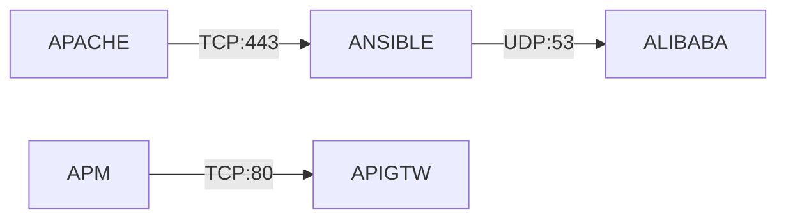
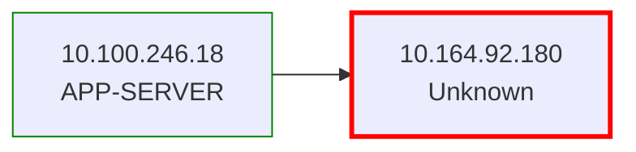
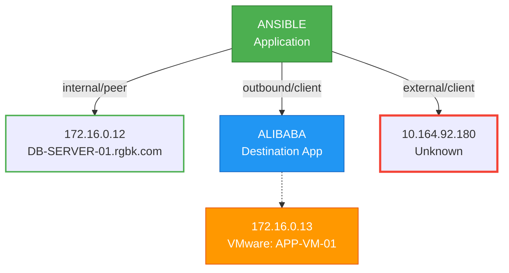

# Batch Output Generation Guide
## Using Enriched flows.csv to Generate Diagrams, Docs, and Analysis

This guide shows you how to use the enriched `flows.csv` files (with all 18 columns) to generate batch outputs.

---

## 📊 Enriched Data Schema (18 Columns)

### Application Context
- **App** - Source application

### Source Information
- **Source IP**
- **Source Hostname** - Clean hostname for comparisons
- **Source Hostname (Full)** - `"VMware AD6FD1 | WAPRCG.rgbk.com"` format
- **Source DNS Status** - `valid`, `valid_forward_only`, `mismatch`, `NXDOMAIN`, `unknown`
- **Source Is VMware** - Boolean

### Destination Information
- **Dest App** - 🆕 Which application this flow goes to
- **Dest IP**
- **Dest Hostname** - Clean hostname for comparisons
- **Dest Hostname (Full)** - `"VMware AD6FD1 | WAPRCG.rgbk.com"` format
- **Dest DNS Status** - `valid`, `valid_forward_only`, `mismatch`, `NXDOMAIN`, `unknown`
- **Dest Is VMware** - Boolean

### Dependency Analysis
- **Flow Direction** - 🆕 `outbound` (inter-app), `internal` (same app), `external` (unknown/internet)
- **Dependency Type** - 🆕 `client` (depends on dest), `server` (provides service), `peer` (internal)

### Flow Details
- **Port**, **Protocol**, **Bytes In**, **Bytes Out**

---

## 🎯 How to Use for Batch Outputs

### 1. **Application Dependency Diagrams**

**What to Show:**
- All `outbound` flows (inter-app dependencies)
- Use `Dest App` to draw arrows between applications
- Color code by `Dependency Type`

**Example Query:**
```python
# Get all inter-app dependencies
dependencies = df[df['Flow Direction'] == 'outbound'][[
    'App', 'Dest App', 'Port', 'Protocol', 'Dependency Type'
]].drop_duplicates()

# Generate Mermaid diagram
for _, row in dependencies.iterrows():
    print(f"{row['App']} -->|{row['Protocol']}:{row['Port']}| {row['Dest App']}")
```

**Output:**


### 2. **VMware Infrastructure Map**

**What to Show:**
- All flows where `Source Is VMware = True` OR `Dest Is VMware = True`
- Use `Source Hostname (Full)` to show VMware info
- Group by VMware hosts

**Example Query:**
```python
# Get all VMware-related flows
vmware_flows = df[(df['Source Is VMware'] == True) | (df['Dest Is VMware'] == True)]

# Show VMware hosts and what they connect to
for _, row in vmware_flows.iterrows():
    if row['Source Is VMware']:
        print(f"VMware: {row['Source Hostname (Full)']} -> {row['Dest Hostname']}")
```

**Output:**
```
VMware: VMware AD6FD1 | WAPRCG.rgbk.com -> APP-SERVER-01.rgbk.com
VMware: vmhost-02 | vmhost-02.rgbk.com -> DB-SERVER-01.rgbk.com
VMware: APP-VM-01 | APP-VM-01.rgbk.com -> ANSIBLE (internal)
```

### 3. **RED BORDER Visualization (Failed DNS)**

**What to Show:**
- Shapes with RED BORDER when `DNS Status = "NXDOMAIN"` OR `Hostname = "Unknown"`
- This highlights servers needing manual investigation

**Example Logic:**
```python
def get_border_style(dns_status, hostname):
    """Return border style based on DNS status"""
    if dns_status == 'NXDOMAIN' or hostname == 'Unknown':
        return 'stroke:red,stroke-width:3px'  # RED BORDER
    elif dns_status == 'mismatch':
        return 'stroke:orange,stroke-width:2px'  # ORANGE BORDER
    else:
        return 'stroke:green,stroke-width:1px'  # NORMAL
```

**Mermaid with Styling:**


### 4. **Threat Surface Analysis**

**What to Show:**
- `external` flows (internet-facing)
- `outbound` flows with high ports (potential backdoors)
- `NXDOMAIN` destinations (suspicious unknown IPs)

**Example Query:**
```python
# Find external/internet-facing flows
external_flows = df[df['Flow Direction'] == 'external']

# Find suspicious patterns
suspicious = external_flows[
    (external_flows['Dest DNS Status'] == 'NXDOMAIN') |
    (external_flows['Port'].isin(['4444', '8080', '3389']))  # Common attack ports
]
```

### 5. **Client-Server Relationship Report**

**What to Show:**
- Who depends on whom
- Service providers vs consumers

**Example Query:**
```python
# Find all servers (apps that are Dest App for others)
servers = df[df['Dest App'].notna()]['Dest App'].unique()

# For each server, find its clients
for server in servers:
    clients = df[df['Dest App'] == server]['App'].unique()
    print(f"\n{server} serves:")
    for client in clients:
        flows = df[(df['App'] == client) & (df['Dest App'] == server)]
        ports = flows['Port'].unique()
        print(f"  - {client} (ports: {', '.join(map(str, ports))})")
```

**Output:**
```
ALIBABA serves:
  - ANSIBLE (ports: 53)

ANSIBLE serves:
  - APACHE (ports: 443, 80)
  - APIGTW (ports: 3306)
```

### 6. **Cross-Reference Report**

**What to Show:**
- Which IPs are shared across applications
- Inter-app communication patterns

**Example Query:**
```python
# Find IPs used by multiple apps
from collections import defaultdict

ip_usage = defaultdict(set)
for _, row in df.iterrows():
    ip_usage[row['Source IP']].add(row['App'])
    if row['Dest App']:
        ip_usage[row['Dest IP']].add(row['Dest App'])

# Show shared IPs
for ip, apps in ip_usage.items():
    if len(apps) > 1:
        print(f"{ip} shared by: {', '.join(apps)}")
```

---

## 🔄 Batch Processing Flow

### Phase A: Data Preparation (DONE)
```bash
python process_all_flows.py
```
- Processes all 166 CSV files
- DNS validation + VMware detection
- Cross-referencing
- Creates enriched `flows.csv` with 18 columns
- **NO diagram generation**

### Phase B: Batch Output Generation (NEXT)
```bash
python run_batch_processing.py --phase-b-only --batch-size 10
```

**What it does:**
1. Reads enriched `flows.csv` from `persistent_data/applications/*/`
2. Generates for each app:
   - **Application Diagram** (`.html`) with RED BORDERS
   - **Dependency Graph** (shows `Dest App` connections)
   - **Threat Surface Analysis** (`.json`)
   - **Documentation** (`.md`)
3. Processes in batches of 10 to avoid memory issues

---

## 📝 Example Batch Generation Script

```python
#!/usr/bin/env python3
"""Generate batch outputs from enriched flows.csv"""

import pandas as pd
from pathlib import Path

def generate_outputs_for_app(app_id: str, flows_df: pd.DataFrame):
    """Generate all outputs for one application"""

    # 1. Application Dependency Diagram
    dependencies = flows_df[flows_df['Flow Direction'] == 'outbound'][
        ['Dest App', 'Port', 'Protocol']
    ].drop_duplicates()

    mermaid = "graph LR\n"
    mermaid += f"  {app_id}[{app_id}]\n"
    for _, dep in dependencies.iterrows():
        if dep['Dest App']:
            mermaid += f"  {app_id} -->|{dep['Protocol']}:{dep['Port']}| {dep['Dest App']}\n"

    # 2. VMware Infrastructure
    vmware_flows = flows_df[
        (flows_df['Source Is VMware'] == True) |
        (flows_df['Dest Is VMware'] == True)
    ]

    # 3. RED BORDER for failed DNS
    for _, row in flows_df.iterrows():
        if row['Dest DNS Status'] == 'NXDOMAIN':
            # Mark with RED BORDER in diagram
            pass

    # 4. Save outputs
    output_dir = Path(f'outputs/{app_id}')
    output_dir.mkdir(parents=True, exist_ok=True)

    with open(output_dir / 'diagram.mmd', 'w') as f:
        f.write(mermaid)

# Process all apps
apps_dir = Path('persistent_data/applications')
for app_dir in apps_dir.iterdir():
    if app_dir.is_dir():
        flows_csv = app_dir / 'flows.csv'
        if flows_csv.exists():
            df = pd.read_csv(flows_csv)
            generate_outputs_for_app(app_dir.name, df)
            print(f"Generated outputs for {app_dir.name}")
```

---

## 🎨 Visualization Examples

### Application Diagram with Enriched Data



---

## 🚀 Ready to Generate!

You now have:
- ✅ 18 enriched columns
- ✅ VMware detection
- ✅ Cross-app dependencies
- ✅ Flow direction & dependency types
- ✅ DNS status for RED BORDER visualization

Next step: Create the batch generation script to process all 166 apps!
