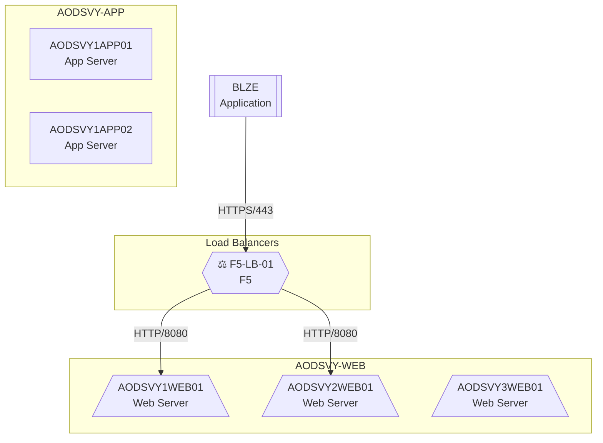
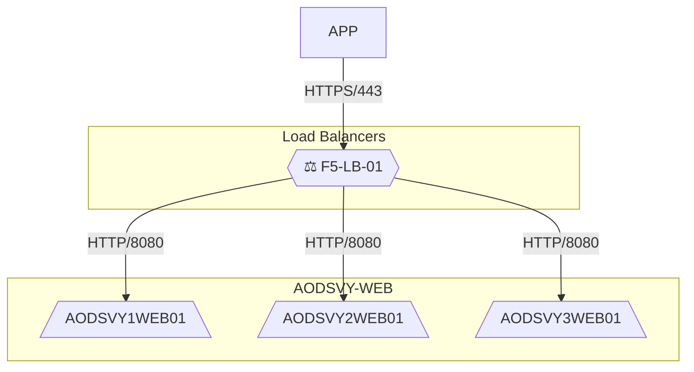

# Post-Processing Diagram Generation

## Overview

This document describes the **post-processing diagram generation system** that generates enhanced network diagrams **AFTER** all batch processing completes, by reading complete data from the PostgreSQL database.

## Key Features

### 1. Server Grouping by Naming Convention
Automatically groups target servers based on naming patterns:

**Example grouping patterns:**
```
AODSVY1WEB01, AODSVY2WEB01, AODSVY3WEB01  →  Group: "AODSVY-WEB"
AODSVY1APP01, AODSVY1APP02, AODSVY1APP03  →  Group: "AODSVY-APP"
AODSVY1DB01                                →  Group: "AODSVY-DB"
```

**Supported patterns:**
- `{PREFIX}{NUMBER}{TYPE}{NUMBER}` - e.g., AODSVY1WEB01
- `{PREFIX}-{TYPE}-{NUMBER}` - e.g., server-web-01
- Servers with same type but different numeric suffixes (01, 02, 03) are grouped together

### 2. Color-Coded Unknown Connections
- **Red lines**: Unknown/unresolved server connections
- **Normal lines**: Known, classified connections
- Makes it easy to spot missing DNS resolutions or unclassified servers

### 3. Visual Boxes Around Groups
Uses Mermaid **subgraphs** to create visual boxes around:
- Server groups (by naming convention)
- Load balancers (separate box)
- Ungrouped servers (catch-all box)

### 4. Load Balancer Identification
Automatically identifies and highlights:
- F5 load balancers
- Azure Traffic Manager
- Other load balancer types

Displayed with special emoji (⚖️) and orange highlighting.

### 5. Multi-Format Output
Generates **4 formats** for each application:
- **MMD** - Mermaid source code
- **HTML** - Interactive diagram (with pan/zoom)
- **PNG** - High-resolution image (4800px)
- **SVG** - Vector format with infinite zoom

---

## Architecture

### Two-Phase Processing Approach

**Phase 1: Batch Processing (`run_batch_processing.py`)**
- Process network flows
- Classify servers (17+ types)
- Identify load balancers
- Analyze source components
- **Store ALL data in PostgreSQL**

**Phase 2: Diagram Generation (`generate_diagrams_from_db.py`)**
- **After** all batches complete
- Query PostgreSQL for complete dataset
- Generate enhanced diagrams with grouping
- Output all formats (MMD, HTML, PNG, SVG)

### Why Post-Processing?

**Advantages:**
1. **Complete data**: Has full picture across all applications
2. **Better grouping**: Can identify patterns across entire dataset
3. **Performance**: Doesn't slow down batch processing
4. **Flexibility**: Can regenerate diagrams without reprocessing flows
5. **Database-driven**: Single source of truth (PostgreSQL)

---

## Usage

### Generate All Applications

```bash
# Generate diagrams for ALL applications in database
python generate_diagrams_from_db.py
```

**Output:**
```
outputs_final/diagrams_enhanced/
├── BLZE_enhanced_diagram.mmd
├── BLZE_enhanced_diagram.html
├── BLZE_enhanced_diagram.png
├── BLZE_enhanced_diagram.svg
├── BM_enhanced_diagram.mmd
├── BM_enhanced_diagram.html
├── BM_enhanced_diagram.png
├── BM_enhanced_diagram.svg
└── ... (154 applications × 4 formats = 616 files)
```

### Generate Specific Applications

```bash
# Generate diagrams for specific apps only
python generate_diagrams_from_db.py --apps BLZE BM BO BOD BP
```

### Generate Specific Formats

```bash
# Only generate SVG files
python generate_diagrams_from_db.py --format svg

# Only generate HTML files
python generate_diagrams_from_db.py --format html
```

---

## How It Works

### 1. Load Data from PostgreSQL

```python
# Query enriched_flows table with server classification
SELECT
    source_app_code,
    source_hostname,
    source_server_type,
    source_server_tier,
    dest_hostname,
    dest_server_type,
    dest_server_tier,
    protocol,
    port
FROM network_analysis.enriched_flows
WHERE source_app_code = 'BLZE'
```

### 2. Identify Server Groups

```python
# Regex patterns to match naming conventions
patterns = [
    # AODSVY1WEB01 -> AODSVY-WEB
    r'^([A-Z]+\d?)([A-Z]{2,4})\d+$',

    # server-web-01 -> server-web
    r'^([a-z\-]+\d?)-([a-z]+)-\d+$',
]

# Group servers by pattern
groups = {
    'AODSVY-WEB': ['AODSVY1WEB01', 'AODSVY2WEB01', 'AODSVY3WEB01'],
    'AODSVY-APP': ['AODSVY1APP01', 'AODSVY1APP02'],
    'AODSVY-DB': ['AODSVY1DB01']
}
```

### 3. Generate Mermaid with Subgraphs



### 4. Apply Visual Styling

**Color coding by tier:**
- Infrastructure servers: Mint green (#E0F2F1)
- Security servers: Coral (#FFCCBC)
- Cloud servers: Purple (#E1BEE7)
- Database servers: Orange (#FFE0B2)

**Unknown connections:**
```mermaid
BLZE -->|TCP/1234| UNKNOWN_SERVER
linkStyle 0 stroke:#f44336,stroke-width:2px  %% RED for unknown
```

### 5. Generate Multi-Format Output

```python
# 1. Save MMD source
Path('BLZE_enhanced_diagram.mmd').write_text(mermaid_code)

# 2. Generate HTML with embedded Mermaid
html = generate_html(mermaid_code, title="BLZE Network Diagram")

# 3. Generate PNG via Mermaid.ink API
generate_png_mermaidink(mermaid_code, width=4800)

# 4. Generate SVG via Mermaid.ink API
generate_svg_mermaidink(mermaid_code)
```

---

## Integration with Batch Processing

### Add as Step 8

Modify `run_batch_processing.py` to add post-processing step:

```python
def main():
    # ... existing steps 1-7 ...

    # Step 8: Generate enhanced diagrams from database
    if not args.skip_enhanced_diagrams:
        logger.info("=" * 80)
        logger.info("Step 8: Generating enhanced diagrams from database")
        logger.info("=" * 80)

        cmd = [
            sys.executable,
            'generate_diagrams_from_db.py',
            '--apps'
        ] + app_codes_processed

        result = subprocess.run(cmd, capture_output=True, text=True)

        if result.returncode == 0:
            logger.info("✓ Enhanced diagrams generated successfully")
        else:
            logger.warning(f"⚠ Enhanced diagram generation failed: {result.stderr}")
```

### Command-Line Flag

```bash
# Run batch processing WITHOUT enhanced diagrams (faster)
python run_batch_processing.py --skip-enhanced-diagrams

# Run batch processing WITH enhanced diagrams (default)
python run_batch_processing.py
```

---

## Database Schema Requirements

The script requires the **enriched_flows** table with server classification columns:

```sql
CREATE TABLE network_analysis.enriched_flows (
    id BIGSERIAL PRIMARY KEY,

    -- Source
    source_app_code VARCHAR(50),
    source_hostname VARCHAR(255),
    source_server_type VARCHAR(50),      -- Required for grouping
    source_server_tier VARCHAR(50),      -- Required for coloring

    -- Destination
    dest_hostname VARCHAR(255),
    dest_server_type VARCHAR(50),        -- Required for grouping
    dest_server_tier VARCHAR(50),        -- Required for coloring

    -- Flow
    protocol VARCHAR(20),
    port INTEGER,

    -- ... other fields ...
);
```

---

## Server Grouping Examples

### Example 1: Web Farm with Load Balancer

**Input hostnames:**
```
F5-LB-01 (Load Balancer)
AODSVY1WEB01 (Web Server)
AODSVY2WEB01 (Web Server)
AODSVY3WEB01 (Web Server)
```

**Generated groups:**
- **LOAD_BALANCERS**: F5-LB-01
- **AODSVY-WEB**: AODSVY1WEB01, AODSVY2WEB01, AODSVY3WEB01

**Diagram:**


### Example 2: 3-Tier Application

**Input hostnames:**
```
AODSVY1WEB01 (Web)
AODSVY1WEB02 (Web)
AODSVY1APP01 (App)
AODSVY1APP02 (App)
AODSVY1DB01 (Database)
```

**Generated groups:**
- **AODSVY-WEB**: AODSVY1WEB01, AODSVY1WEB02
- **AODSVY-APP**: AODSVY1APP01, AODSVY1APP02
- **AODSVY-DB**: AODSVY1DB01

**Diagram shows clear 3-tier architecture with visual separation**

### Example 3: Mixed Environment with Unknowns

**Input hostnames:**
```
known-server-01 (Web Server)
known-server-02 (Web Server)
Unknown (unresolved DNS)
10.147.20.100 (IP only, no DNS)
```

**Generated groups:**
- **GROUP-WEB-SERVER**: known-server-01, known-server-02
- **UNGROUPED**: Unknown, 10.147.20.100

**Unknown connections shown in RED**

---

## Troubleshooting

### Issue 1: No diagrams generated

**Cause:** Database not accessible or no data

**Fix:**
```bash
# Check database connection
python -c "from src.database.flow_repository import FlowRepository; repo=FlowRepository(); print(f'Connected: {repo.connection_pool is not None}')"

# Check if enriched_flows table exists
python -c "from src.database.flow_repository import FlowRepository; repo=FlowRepository()"
```

### Issue 2: PNG/SVG generation fails

**Cause:** Mermaid.ink API rate limiting or network issues

**Fix:**
```bash
# Generate only MMD and HTML first
python generate_diagrams_from_db.py --format html

# Then regenerate PNG/SVG separately with delays
python generate_diagrams_from_db.py --format png
python generate_diagrams_from_db.py --format svg
```

### Issue 3: Groups not forming correctly

**Cause:** Server naming convention doesn't match patterns

**Fix:** Add custom pattern to `_identify_server_groups()` method:

```python
# In generate_diagrams_from_db.py, add your pattern:
patterns = [
    # Existing patterns...

    # Your custom pattern
    (r'^YOUR_PATTERN$', lambda m: f"{m.group(1)}-{m.group(2)}"),
]
```

---

## Performance

### Timing Estimates

| Applications | MMD + HTML | + PNG | + SVG | Total |
|-------------|-----------|-------|-------|-------|
| 10 apps     | 5 sec     | 30 sec| 30 sec| ~1 min|
| 50 apps     | 20 sec    | 2 min | 2 min | ~4 min|
| 154 apps    | 60 sec    | 6 min | 6 min | ~13 min|

**Note:** PNG and SVG generation via Mermaid.ink API is the bottleneck (HTTP requests)

### Optimization Options

1. **Skip PNG/SVG for development:**
   ```bash
   python generate_diagrams_from_db.py --format html
   ```

2. **Process subset first:**
   ```bash
   python generate_diagrams_from_db.py --apps BLZE BM BO
   ```

3. **Parallel processing (future enhancement):**
   - Use ThreadPoolExecutor for concurrent API calls
   - Add rate limiting to respect Mermaid.ink limits

---

## Future Enhancements

### Planned Features

1. **Custom grouping rules**
   - User-defined regex patterns
   - Configuration file for grouping logic

2. **Interactive HTML features**
   - Click server to show details
   - Filter by server type/tier
   - Search functionality

3. **DOCX generation**
   - Embedded diagrams
   - Server classification summary tables
   - Group membership lists

4. **Diff mode**
   - Compare diagrams over time
   - Highlight changes in network topology

5. **Performance optimization**
   - Parallel PNG/SVG generation
   - Local mmdc fallback
   - Caching of Mermaid.ink results

---

## Related Files

- `generate_diagrams_from_db.py` - Main script
- `src/database/flow_repository.py` - Database access layer
- `src/server_classifier.py` - Server type classification
- `src/source_component_analyzer.py` - Load balancer detection
- `src/diagram_format_generator.py` - Multi-format generation

---

**Created:** 2025-10-22
**Purpose:** Document post-processing diagram generation system
**Status:** Implemented and ready for testing
