# Network Segmentation Analyzer - Requirements Roadmap

## 📋 Original 9 Requirements Analysis

This document maps each requirement to implementation approach and priority.

---

## ✅ **Requirement 7: Images Illegible in Word Doc** (HIGHEST PRIORITY)

### Problem:
"Images are overly compressed and illegible in Word Doc."

### Root Cause:
- Current: PNG raster format at 4800px
- Word compression reduces quality
- Zoom causes pixelation/blur

### Solution: **SVG + PNG Dual Format**

**Why SVG solves this:**
- Vector format = infinite zoom without quality loss
- No compression artifacts
- Crisp text at any size
- Word 2013+ supports SVG natively

**Implementation:**

#### Step 1: Replace PNG Generator (30 minutes)
```bash
# Source file exists:
C:\Users\AjayPillai\Downloads\generate_pngs_and_svgs_python.py

# Action:
cp "C:\Users\AjayPillai\Downloads\generate_pngs_and_svgs_python.py" generate_pngs_python.py
```

**Features:**
- `--format png|svg|both` argument
- Mermaid.ink API for both formats
- Fallback to mmdc CLI
- Same file structure

#### Step 2: Update Word Document Generator (1 hour)
**File:** `src/docx_generator.py`

**Current code (line 432):**
```python
self.doc.add_picture(self.png_path, width=Inches(8.5))
```

**New approach:**
```python
# Try SVG first (better quality)
svg_path = self.png_path.replace('.png', '.svg')
if Path(svg_path).exists():
    self.doc.add_picture(svg_path, width=Inches(8.5))
    logger.info(f"  SVG embedded: {Path(svg_path).name}")
else:
    # Fallback to PNG
    self.doc.add_picture(self.png_path, width=Inches(8.5))
    logger.info(f"  PNG embedded: {Path(self.png_path).name}")
```

**Benefits:**
- ✅ Infinite zoom in Word documents
- ✅ No pixelation
- ✅ Crisp diagrams at any size
- ✅ Backward compatible (PNG fallback)

**Testing:**
```bash
# Generate both formats
python generate_pngs_python.py --format both --apps BLZE

# Check outputs
ls outputs_final/diagrams/BLZE_diagram.*
# Should show: .mmd, .html, .png, .svg
```

---

## 📊 **Requirements 1 & 2: App Code Identification**

### Requirement 1:
"Communication flows appear very basic, unclear if between servers in the same or different app codes. Recommend listing app codes for both source and destination servers where known."

### Requirement 2:
"Manual intervention required to identify source and destination app codes."

### Current State:
Diagrams show IP addresses and hostnames, but not which app code owns each server.

### Solution: **Add App Code Labels**

**Implementation in `src/diagrams.py`:**

#### Option A: Enhanced Node Labels


#### Option B: Edge Labels with App Codes

```mermaid
graph TB
    node1["10.164.144.23<br/>blze-cache-01"]
    node2["10.164.116.124<br/>blze-db-primary"]

    node1 -->|"BLZE → BLZE<br/>TCP:5432<br/>INTRA-APP"| node2
```


**Code Changes (src/diagrams.py):**

**Line ~280 (Current):**
```python
hostname, display_label = self.hostname_resolver.resolve_with_display(comp_ip, tier)
```

**Enhanced:**
```python
# Get hostname
hostname, display_label = self.hostname_resolver.resolve_with_display(comp_ip, tier)

# Get app code for this IP
app_code = self._get_app_code_for_ip(comp_ip)  # NEW METHOD

# Enhanced label format
if app_code:
    display_label = f"{comp_ip}<br/><b>[{app_code}]</b><br/>{hostname}<br/>{tier}"
else:
    display_label = f"{comp_ip}<br/><b>[UNKNOWN]</b><br/>{hostname}<br/>{tier}"
```

**New Method to Add:**
```python
def _get_app_code_for_ip(self, ip: str) -> str:
    """
    Get app code for an IP address by matching against flow records

    Args:
        ip: IP address to lookup

    Returns:
        App code or None if not found
    """
    # Check flow records for this IP as source
    for record in self.records:
        if record.src_ip == ip and hasattr(record, 'app_name'):
            return record.app_name

    # Not found
    return None
```

**Benefits:**
- ✅ Immediate visual identification of app ownership
- ✅ No manual lookup needed
- ✅ Clear intra-app vs inter-app flows

---

## 🔍 **Requirement 3: Source Hosts Lack Names**

### Problem:
"Source hosts lack names, making server identification difficult."

### Current State:
**ALREADY IMPLEMENTED!** ✅

The hostname resolver exists and is active:
- **File:** `src/diagrams.py` line 281
- **Method:** `self.hostname_resolver.resolve_with_display()`

### Verification Needed:
Check if DNS resolution is working properly in generated diagrams.

**Test:**
```bash
# Check if hostnames appear in diagrams
grep -r "hostname" outputs_final/diagrams/*.mmd

# Should see hostnames, not just IPs
```

**If hostnames missing:**
1. Check DNS resolution is enabled
2. Verify `hostname_resolver` is initialized
3. Add fallback DNS lookup if needed

---

## 🔌 **Requirement 4: No Ports/Protocols Provided**

### Problem:
"No ports/protocols provided; future segmentation will require re-analysis."

### Current State:
Flow records have port/protocol data, but edge labels don't show it clearly.

### Solution: **Enhanced Edge Labels**

**Current edge label (line ~514):**
```python
lines.append(f"    {src_safe} ==>|{count} flows<br/>HIGH| {dst_safe}")
```

**Enhanced edge label:**
```python
# Get flow details
protocols = flow_summary[key].get('protocols', set())
protocol_str = ', '.join(sorted(protocols)) if protocols else 'UNKNOWN'

# Build rich label
label_parts = [
    f"{count} flows",
    f"{protocol_str}",
    "HIGH VOLUME"
]
label = '<br/>'.join(label_parts)

lines.append(f"    {src_safe} ==>|{label}| {dst_safe}")
```

**Result:**
```mermaid
node1 ==>|"250 flows<br/>TCP:443, TCP:5432<br/>HIGH VOLUME"| node2
```

**Benefits:**
- ✅ Port/protocol visible at a glance
- ✅ No re-analysis needed for future segmentation
- ✅ Multiple protocols shown if applicable

---

## 📈 **Requirement 5: Limited Usefulness Without Effort**

### Problem:
"Output mainly identifies communication flows from Extrahop data; limited usefulness without more effort from app owners or Cyber team."

### Solution: **Rich Metadata & Interactive Features**

**Implementation in HTML diagrams:**

#### Add Metadata Panel
```html
<div id="metadata-panel" style="position: fixed; right: 20px; top: 80px;
     background: white; border: 1px solid #ccc; padding: 15px;
     border-radius: 5px; max-width: 300px;">
    <h3>Flow Statistics</h3>
    <ul>
        <li>Total Flows: <strong>1,247</strong></li>
        <li>Unique Source IPs: <strong>23</strong></li>
        <li>Unique Dest IPs: <strong>45</strong></li>
        <li>Intra-App Flows: <strong>892</strong></li>
        <li>Inter-App Flows: <strong>355</strong></li>
        <li>Total Bandwidth: <strong>12.4 GB</strong></li>
    </ul>

    <h3>Protocols Used</h3>
    <ul>
        <li>TCP:443 (HTTPS) - 67%</li>
        <li>TCP:5432 (PostgreSQL) - 23%</li>
        <li>TCP:6379 (Redis) - 10%</li>
    </ul>

    <h3>Missing Data</h3>
    <ul style="color: red;">
        <li>⚠ 12 hosts missing hostnames</li>
        <li>⚠ 5 flows missing port info</li>
    </ul>
</div>
```

**Benefits:**
- ✅ Self-explanatory diagrams
- ✅ Actionable insights visible
- ✅ Less manual effort required

---

## ↔️ **Requirement 6: Flow Direction Issues**

### Problem:
"Diagram shows ingress to OpenShift, but the flow is egress (not targeting load balancers as required for ingress into OpenShift)."

### Solution: **Explicit Flow Direction Labels**

**Detection Logic:**
```python
def _detect_flow_direction(self, src_ip, dst_ip, dst_port):
    """
    Detect if flow is ingress or egress

    Ingress: External → Load Balancer → Internal
    Egress: Internal → External
    """
    # Known load balancer IPs (from config)
    LOAD_BALANCERS = ['10.164.105.10', '10.164.105.11', ...]

    # Check if destination is load balancer
    if dst_ip in LOAD_BALANCERS and dst_port in [80, 443, 8080, 8443]:
        return 'INGRESS'

    # Check if flow goes to external
    if self._is_external(dst_ip):
        return 'EGRESS'

    # Internal to internal
    return 'INTERNAL'
```

**Visual Indicators:**
```mermaid
EXTERNAL ==>|"[INGRESS]<br/>HTTPS:443"| LOAD_BALANCER
LOAD_BALANCER ==>|"[INTERNAL]<br/>HTTP:8080"| APP_SERVER
APP_SERVER -->|"[EGRESS]<br/>HTTPS:443"| EXTERNAL_API
```

**Arrow Styles:**
- `==>` Bold arrow for INGRESS
- `-->` Normal arrow for EGRESS
- `-.->` Dashed for uncertain

---

## 🖼️ **Requirement 7: Already Covered Above**

See "Requirement 7: Images Illegible" section at top.

---

## ⌨️ **Requirement 8: Browser Navigation Issues**

### Problem:
"Browser-based application diagrams are hard to navigate; arrow keys don't work."

### Solution: **Keyboard Navigation**

**Add to HTML diagrams (`src/diagrams.py` around line 900):**

```javascript
// Keyboard navigation
document.addEventListener('keydown', function(e) {
    const panAmount = 50;
    const zoomFactor = 0.1;

    switch(e.key) {
        case 'ArrowUp':
            svgPanZoom.panBy({x: 0, y: panAmount});
            e.preventDefault();
            break;
        case 'ArrowDown':
            svgPanZoom.panBy({x: 0, y: -panAmount});
            e.preventDefault();
            break;
        case 'ArrowLeft':
            svgPanZoom.panBy({x: panAmount, y: 0});
            e.preventDefault();
            break;
        case 'ArrowRight':
            svgPanZoom.panBy({x: -panAmount, y: 0});
            e.preventDefault();
            break;
        case '+':
        case '=':
            svgPanZoom.zoomIn();
            e.preventDefault();
            break;
        case '-':
        case '_':
            svgPanZoom.zoomOut();
            e.preventDefault();
            break;
        case 'Home':
            svgPanZoom.reset();
            e.preventDefault();
            break;
        case ' ':
            // Toggle pan mode
            e.preventDefault();
            break;
    }
});

// Add keyboard instructions
const instructions = document.createElement('div');
instructions.innerHTML = `
    <div style="position: fixed; bottom: 20px; left: 20px;
                background: rgba(0,0,0,0.7); color: white;
                padding: 10px; border-radius: 5px; font-size: 12px;">
        <strong>Keyboard Shortcuts:</strong><br/>
        Arrow Keys: Pan<br/>
        +/- : Zoom<br/>
        Home: Reset View
    </div>
`;
document.body.appendChild(instructions);
```

---

## 🔴 **Requirement 9: Missing Information Indicators**

### Problem:
"Code Missing Information on diagrams code in a color (perhaps red) to indicated."

### Solution: **Red Color Coding for Missing Data**

**Mermaid Diagram Styling:**

```python
# Define warning styles for missing data
lines.append("    classDef missingHostname fill:#ffcccc,stroke:#cc0000,stroke-width:3px,color:#000")
lines.append("    classDef missingPort fill:#ffe5cc,stroke:#ff9900,stroke-width:2px,color:#000")
lines.append("    classDef missingAppCode fill:#ffccff,stroke:#cc00cc,stroke-width:2px,color:#000")

# Apply styles based on data availability
for comp in components:
    classes = []
    missing_fields = []

    if not comp['hostname']:
        classes.append('missingHostname')
        missing_fields.append('hostname')
        comp['display_label'] = f"{comp['ip']}<br/>⚠ NO HOSTNAME"

    if not comp['port']:
        classes.append('missingPort')
        missing_fields.append('port')

    if not comp['app_code']:
        classes.append('missingAppCode')
        missing_fields.append('app_code')
        comp['display_label'] += "<br/>⚠ UNKNOWN APP"

    # Apply classes
    if classes:
        lines.append(f"    class {comp['safe_name']} {','.join(classes)}")
```

**Legend:**
```mermaid
subgraph Legend
    missing1[⚠ Missing Hostname]:::missingHostname
    missing2[⚠ Missing Port]:::missingPort
    missing3[⚠ Unknown App]:::missingAppCode
end
```

**Benefits:**
- ✅ Visual warning for incomplete data
- ✅ Clear action items highlighted
- ✅ Easy to identify data gaps

---

## 📊 **Implementation Priority**

### Phase 1: High Impact, Quick Wins (2-3 hours)
1. **✅ Req 7:** SVG+PNG generator (30 min)
2. **✅ Req 7:** Update docx_generator (1 hour)
3. **✅ Req 4:** Add port/protocol to labels (30 min)
4. **✅ Req 9:** Add missing data colors (1 hour)

### Phase 2: Medium Impact (3-4 hours)
5. **✅ Req 1-2:** Add app code labels (2 hours)
6. **✅ Req 6:** Add flow direction indicators (1 hour)
7. **✅ Req 8:** Keyboard navigation (1 hour)

### Phase 3: Polish (2-3 hours)
8. **✅ Req 3:** Verify hostname resolution (30 min)
9. **✅ Req 5:** Add metadata panel (2 hours)

**Total Estimated Time:** 8-10 hours

---

## 🎯 **Success Criteria**

| Requirement | Before | After | Verification |
|-------------|--------|-------|--------------|
| 1-2: App Codes | ❌ Manual lookup | ✅ Auto-labeled | Check diagram labels |
| 3: Hostnames | ⚠️ Partially | ✅ All resolved | Grep for IPs vs hostnames |
| 4: Ports/Protocols | ❌ Missing | ✅ On every edge | Check edge labels |
| 5: Usefulness | ⚠️ Basic | ✅ Rich metadata | Test with user |
| 6: Flow Direction | ❌ Incorrect | ✅ Labeled correctly | Verify ingress/egress |
| 7: Image Quality | ❌ Pixelated | ✅ SVG crisp | Zoom in Word doc |
| 8: Navigation | ❌ No keyboard | ✅ Arrow keys work | Test HTML diagram |
| 9: Missing Data | ❌ Not visible | ✅ Red highlighted | Look for red nodes |

---

## 📋 **Testing Checklist**

### After Implementation:
- [ ] Generate diagram with SVG: `python generate_pngs_python.py --format svg --apps BLZE`
- [ ] Check SVG file exists: `ls outputs_final/diagrams/BLZE_diagram.svg`
- [ ] Open in Word, verify zoom quality
- [ ] Check app code labels appear
- [ ] Verify port/protocol on edges
- [ ] Test arrow keys in HTML diagram
- [ ] Look for red nodes (missing data)
- [ ] Verify ingress/egress labels
- [ ] Check metadata panel shows statistics

---

**Ready to implement!** Which requirement should we start with?

**Recommended order:**
1. Req 7 (SVG) - Biggest impact, easiest to implement
2. Req 4 (Ports) - Quick win
3. Req 9 (Red colors) - Visual impact
4. Req 1-2 (App codes) - Most requested feature
