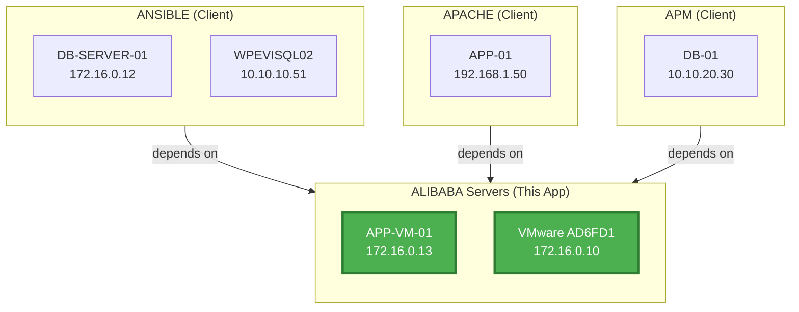
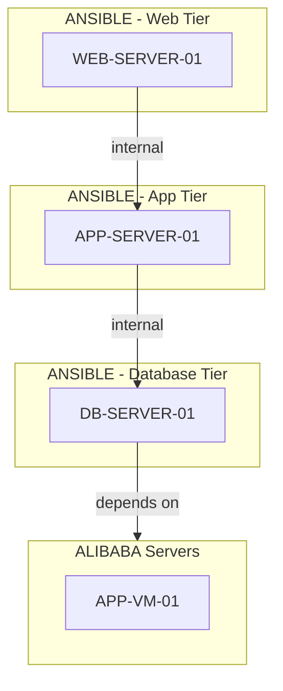

# Upstream vs Downstream Dependencies - Complete Guide

## Current Implementation: Downstream (What This App Depends On)

Currently, the reports show **DOWNSTREAM dependencies** - applications that THIS app depends on.

### Example: ANSIBLE Report
```
ANSIBLE - Web Tier
  └─ WEB-SERVER-01
       ↓ internal
ANSIBLE - App Tier
  └─ APP-SERVER-01
       ↓ internal
ANSIBLE - Database Tier
  └─ DB-SERVER-01
       ↓ depends on
ALIBABA Servers (DESTINATION)
  └─ VMware Host 1
       ↓ external
External / Internet
```

**This shows**: ANSIBLE depends on ALIBABA and External services (downstream)

---

## How to Show UPSTREAM Dependencies (Who Depends on Me)

To show **upstream dependencies** (which applications depend on THIS app), we need to query the data differently.

### Concept

**Upstream**: Applications that have flows pointing TO this application
- Query: Find all flows where `Dest App == THIS_APP`
- Shows: Who is calling/using THIS application

**Downstream**: Applications that this app points TO
- Query: Find all flows where `App == THIS_APP` and `Dest App != ''`
- Shows: Who THIS application depends on (current implementation)

---

## Implementation Options

### Option 1: Separate Upstream Report

Create a separate report showing only upstream dependencies.

**Query Logic**:
```python
def get_upstream_dependencies(app_id: str, all_flows_df: pd.DataFrame):
    """Get applications that depend on THIS app"""
    # Find flows where this app is the DESTINATION
    upstream_flows = all_flows_df[all_flows_df['Dest App'] == app_id]

    # Group by source application
    upstream_apps = upstream_flows.groupby('App')

    return upstream_apps
```

**Example Visualization**:
```
Who Depends on ALIBABA?
========================

ANSIBLE - Database Tier
  ├─ DB-SERVER-01 (172.16.0.12)
  └─ WPEVISQL02 (10.10.10.51)
       ↓ depends on
ALIBABA Servers
  ├─ APP-VM-01 (172.16.0.13)
  └─ VMware AD6FD1 (172.16.0.10)

APACHE - App Tier
  └─ APP-01 (192.168.1.50)
       ↓ depends on
ALIBABA Servers
```

### Option 2: Combined Diagram (Upstream + Downstream)

Show both directions in one diagram.

**Structure**:
```
┌─────────────────────────────────────┐
│      UPSTREAM DEPENDENCIES          │
│   (Who Depends on This App)         │
├─────────────────────────────────────┤
│                                     │
│  ANSIBLE-DB → ALIBABA               │
│  APACHE-APP → ALIBABA               │
│  APM-DB     → ALIBABA               │
│                                     │
└──────────────┬──────────────────────┘
               ↓
┌─────────────────────────────────────┐
│        THIS APPLICATION             │
│            ALIBABA                  │
└──────────────┬──────────────────────┘
               ↓
┌─────────────────────────────────────┐
│     DOWNSTREAM DEPENDENCIES         │
│   (What This App Depends On)        │
├─────────────────────────────────────┤
│                                     │
│  ALIBABA → External Services        │
│  ALIBABA → Database XYZ             │
│                                     │
└─────────────────────────────────────┘
```

### Option 3: Side-by-Side View

Two columns showing both views.

```
┌──────────────────┬──────────────────┐
│   UPSTREAM       │   DOWNSTREAM     │
├──────────────────┼──────────────────┤
│ ANSIBLE          │ External         │
│   └─ DB Tier     │   └─ 1.0.0.1     │
│                  │                  │
│ APACHE           │ DATABASE-CLUSTER │
│   └─ App Tier    │   └─ SQL-01      │
│                  │                  │
│ APM              │                  │
│   └─ DB Tier     │                  │
└──────────────────┴──────────────────┘
```

---

## Data Structure for Upstream

### Current Enriched Data (18 Columns)
```
App,        Source IP,    Dest App,    Flow Direction
ANSIBLE,    172.16.0.12,  ALIBABA,     outbound
APACHE,     192.168.1.50, ALIBABA,     outbound
APM,        10.10.20.30,  ALIBABA,     outbound
```

### Reverse Query for Upstream
To find who depends on ALIBABA:
```python
# Filter where Dest App == 'ALIBABA'
upstream_flows = all_flows_df[all_flows_df['Dest App'] == 'ALIBABA']

# Group by source App
upstream_by_app = upstream_flows.groupby('App')

# Result:
# ANSIBLE has flows to ALIBABA
# APACHE has flows to ALIBABA
# APM has flows to ALIBABA
```

---

## Implementation Code Example

### Create Upstream Report Generator

```python
def generate_upstream_diagram(app_id: str, all_apps_dir: Path) -> str:
    """Generate diagram showing who depends on this app"""

    # Load ALL flows from ALL applications
    all_flows = []
    for app_dir in all_apps_dir.iterdir():
        flows_csv = app_dir / 'flows.csv'
        if flows_csv.exists():
            df = pd.read_csv(flows_csv)
            all_flows.append(df)

    all_flows_df = pd.concat(all_flows, ignore_index=True)

    # Find flows where this app is the DESTINATION
    upstream_flows = all_flows_df[all_flows_df['Dest App'] == app_id]

    if len(upstream_flows) == 0:
        return f"No upstream dependencies found for {app_id}"

    # Build Mermaid diagram
    mermaid = "graph TB\\n"
    mermaid += f"    %% Who depends on {app_id}\\n\\n"

    # Group by source application
    for source_app in upstream_flows['App'].unique():
        app_flows = upstream_flows[upstream_flows['App'] == source_app]

        # Add source app subgraph
        mermaid += f"    subgraph {source_app}_CLIENTS[\"{source_app} (Client)\"]\\n"
        mermaid += f"        direction TB\\n"

        # Add source servers
        for idx, row in app_flows.iterrows():
            src_id = f"{source_app}_SRC_{idx}"
            src_hostname = row['Source Hostname']
            src_ip = row['Source IP']
            mermaid += f"        {src_id}[\"{src_hostname}<br/>{src_ip}\"]\\n"

        mermaid += f"    end\\n\\n"

    # Add THIS application (the destination)
    mermaid += f"    subgraph {app_id}_SERVERS[\"{app_id} Servers (This App)\"]\\n"
    mermaid += f"        direction TB\\n"

    # Add destination servers
    for dest_ip in upstream_flows['Dest IP'].unique():
        dest_hostname = upstream_flows[upstream_flows['Dest IP'] == dest_ip]['Dest Hostname'].iloc[0]
        mermaid += f"        DEST_{dest_ip.replace('.', '_')}[\"{dest_hostname}<br/>{dest_ip}\"]:::targetapp\\n"

    mermaid += f"    end\\n\\n"

    # Connect source apps to this app
    for source_app in upstream_flows['App'].unique():
        mermaid += f"    {source_app}_CLIENTS -->|depends on| {app_id}_SERVERS\\n"

    # Add styles
    mermaid += f"\\n    classDef targetapp fill:#4CAF50,stroke:#2E7D32,stroke-width:3px,color:#fff\\n"

    return mermaid
```

### Usage
```python
# Generate downstream (current)
downstream_html = generate_complete_reports(app_id='ALIBABA')

# Generate upstream (new)
upstream_mermaid = generate_upstream_diagram(app_id='ALIBABA')
```

---

## Visual Examples

### Example 1: ALIBABA Upstream View
**Shows**: Who depends on ALIBABA?



### Example 2: ANSIBLE Downstream View (Current)
**Shows**: What ANSIBLE depends on



---

## Integration into Report Generator

### Add Upstream Tab to HTML

Update the HTML template to include tabs:

```html
<div class="tabs">
    <button class="tab active" onclick="showTab('downstream')">
        Downstream (What We Depend On)
    </button>
    <button class="tab" onclick="showTab('upstream')">
        Upstream (Who Depends on Us)
    </button>
    <button class="tab" onclick="showTab('combined')">
        Full View (Both Directions)
    </button>
</div>

<div id="downstream-diagram" class="tab-content active">
    <!-- Current diagram -->
</div>

<div id="upstream-diagram" class="tab-content">
    <!-- Upstream diagram -->
</div>

<div id="combined-diagram" class="tab-content">
    <!-- Combined view -->
</div>
```

---

## Benefits of Showing Upstream

### Security Analysis
- **Impact Assessment**: If ALIBABA goes down, see who is affected (ANSIBLE, APACHE, APM)
- **Blast Radius**: Understand dependency chains
- **Zero Trust**: Identify which apps should have access

### Architecture Planning
- **Critical Services**: Services with many upstream dependencies are critical
- **Decoupling**: Identify tight coupling that needs refactoring
- **Load Analysis**: See who is hitting each service

### Compliance
- **Data Flow Mapping**: Required for GDPR, SOC2, etc.
- **Access Control**: Verify only authorized apps are connecting
- **Audit Trail**: Document legitimate dependencies

---

## Next Steps to Implement Upstream

1. **Create upstream diagram generator** function
2. **Load all flows** from all applications (not just one app)
3. **Filter by Dest App** to find upstream callers
4. **Add tabs to HTML** template for switching views
5. **Update statistics** to show upstream/downstream counts
6. **Generate upstream DOCX** reports

---

## Query Examples

### Find Upstream Dependencies
```sql
-- Who depends on ALIBABA?
SELECT DISTINCT App,
       COUNT(*) as flow_count
FROM all_flows
WHERE Dest_App = 'ALIBABA'
GROUP BY App
```

### Find Downstream Dependencies
```sql
-- What does ANSIBLE depend on?
SELECT DISTINCT Dest_App,
       COUNT(*) as flow_count
FROM all_flows
WHERE App = 'ANSIBLE'
  AND Dest_App != ''
GROUP BY Dest_App
```

### Critical Services (Most Upstream Dependencies)
```sql
-- Which apps are most depended upon?
SELECT Dest_App,
       COUNT(DISTINCT App) as dependent_app_count,
       COUNT(*) as total_flows
FROM all_flows
WHERE Dest_App != ''
GROUP BY Dest_App
ORDER BY dependent_app_count DESC
```

---

## Summary

**Current Report**: Shows DOWNSTREAM (who this app depends on)
- Direction: This App → Other Apps
- Question: "What does this app need?"

**Upstream Report**: Shows UPSTREAM (who depends on this app)
- Direction: Other Apps → This App
- Question: "Who needs this app?"

**Best Practice**: Show BOTH in professional reports with tabs or side-by-side views!

Would you like me to implement the upstream view?
